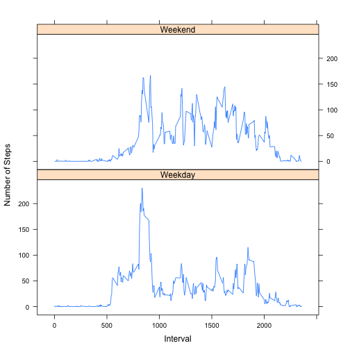

Personal Activity Monitoring
========================================================

# Reproducible Research: Peer Assessment 1

## Background Information
Peer Assessment Activity #1 for "Reproducible Research" on Coursera,
June 2014

Data source: Github Repository, https://github.com/rdpeng/RepData_PeerAssessment1,
cloned on 6/11/2014

Report generated using RStudio, Version 0.98.507, on a 
Macintosh; Intel Mac OS X 10_9_3

## Introduction

This assignment makes use of data from a personal activity monitoring device. 
This device collects data at 5 minute intervals throughout the day. The data 
consists of two months of data from an anonymous individual collected during 
the months of October and November, 2012 and include the number of steps taken 
in 5 minute intervals each day.

The variables included in this dataset are:

- steps: Number of steps taking in a 5-minute interval (missing values are coded
as NA)

- date: The date on which the measurement was taken in YYYY-MM-DD format

- interval: Identifier for the 5-minute interval in which measurement was taken

The dataset is stored in a comma-separated-value (CSV) file and there are a total
of 17,568 observations in this dataset.

The following sections will demonstrate/answer the following questions:

- Loading and preprocessing the data

- What is the mean total number of steps taken per day?

- What is the average daily activity pattern?

- Does interpolation of missing values change the observed patterns?

- Are there differences in activity patterns between weekdays and weekends?

## Loading and Preprocessing the data

The following assumes that the github repo has been forked/cloned, the zip file
(activity.zip) has been unzipped, and the data is available as "activity.csv".


```r
activity <- read.csv("activity.csv")
head(activity)
```

```
##   steps       date interval
## 1    NA 2012-10-01        0
## 2    NA 2012-10-01        5
## 3    NA 2012-10-01       10
## 4    NA 2012-10-01       15
## 5    NA 2012-10-01       20
## 6    NA 2012-10-01       25
```

```r

good <- complete.cases(activity)
activityNoNA <- activity[good, ]
missingRows <- nrow(activity) - nrow(activityNoNA)
```


The processed data sets now are:

- activity, and

- activityNoNA  with the NA values filtered out.

## What is the Mean Number of Steps Taken Per Day?

The histogram is a frequency graph of daily steps over the measurement period.


```r
dailyStepsGraph <- function(df) {
    hist(aggregate(steps ~ date, df, sum)$steps, xlab = "Daily Steps", main = "Total number of steps taken per day", 
        breaks = 8)
}
dailyStepsGraph(activityNoNA)
```

 

```r
dailyStepMean <- mean(aggregate(steps ~ date, activityNoNA, sum)$steps)
dailyStepMedian <- median(aggregate(steps ~ date, activityNoNA, sum)$steps)
```


The mean daily step count is 1.0766 &times; 10<sup>4</sup>, and the median daily step
count is 10765.

## What is the Average Daily Activity Pattern?

The time series plot shows the number of steps taken per 5-second time interval
(intervals are expressed as 100*(hrs past midnight) + minutes, = 0 to 2355), 
summed over all the observed days.


```r

ada <- aggregate(steps ~ interval, activityNoNA, mean)$steps
aveDailyActivityGraph <- function(agg, df) {
    y <- df$interval[1:288]
    plot(y, agg, type = "l", xlab = "Time (5 second intervals)", ylab = "Steps (averaged over all days)", 
        main = "Average Daily Activity Pattern", col = "blue")
}
aveDailyActivityGraph(ada, activityNoNA)
```

 

```r

mostActive <- activity$interval[which.max(ada)]
maHour <- round(mostActive/100)
maMinute <- mostActive - 100 * maHour
```


The "busy time" for this interval, i.e. the 5 minute interval with the highest
average number of steps, was 835, or 8:35

## What is the Effect of Interpolating Over Missing Values

The activity data has 2304 time intervals where step data is NA.
If we interpolate over those missing values using the mean over all days of the 
steps for the interval, the shape of the time series graph is unchanged.
The shape of the histogram is unchanged, although slightly more peaked.


```r
# lookup contains the average interval steps for every interval
lookup <- cbind(activity$interval, ada)

# change the date column to a factor variable, then reassign to Weekday or
# Weekend
activity <- cbind(activity, as.factor(weekdays(as.POSIXct(activity$date))))
names(activity) <- c("steps", "date", "interval", "day")
levels(activity$day)[levels(activity$day) == "Friday"] <- "Weekday"
levels(activity$day)[levels(activity$day) == "Monday"] <- "Weekday"
levels(activity$day)[levels(activity$day) == "Tuesday"] <- "Weekday"
levels(activity$day)[levels(activity$day) == "Wednesday"] <- "Weekday"
levels(activity$day)[levels(activity$day) == "Thursday"] <- "Weekday"
levels(activity$day)[levels(activity$day) == "Saturday"] <- "Weekend"
levels(activity$day)[levels(activity$day) == "Sunday"] <- "Weekend"

# if steps is NA, replace it with the average over all the days
interpolated <- activity
for (i in 1:nrow(activity)) {
    if (is.na(activity$steps[i])) {
        interpolated[i, 1] <- lookup[i, 2]
    }
}

dailyStepsGraph(interpolated)
```

 

```r
adaInterpolated <- aggregate(steps ~ interval, interpolated, mean)$steps
aveDailyActivityGraph(adaInterpolated, interpolated)
```

 

```r


dailyStepMeanI <- mean(aggregate(steps ~ date, interpolated, sum)$steps)
dailyStepMedianI <- median(aggregate(steps ~ date, interpolated, sum)$steps)
```


Using the interpolated data, the mean daily step count is 1.0766 &times; 10<sup>4</sup>, 
and the median daily step count is 1.0766 &times; 10<sup>4</sup>, virtually unchanged from
the original data.

## Are there differences in activity patterns between weekdays and weekends?

The following two plots show the clear differences in activity patterns between 
weekdays and weekends.


```r

library(lattice)
xyplot(steps ~ interval | day, data = aggregate(steps ~ interval + day, data = interpolated, 
    mean), type = "l", xlab = "Interval", ylab = "Number of Steps", layout = c(1, 
    2))
```

 

